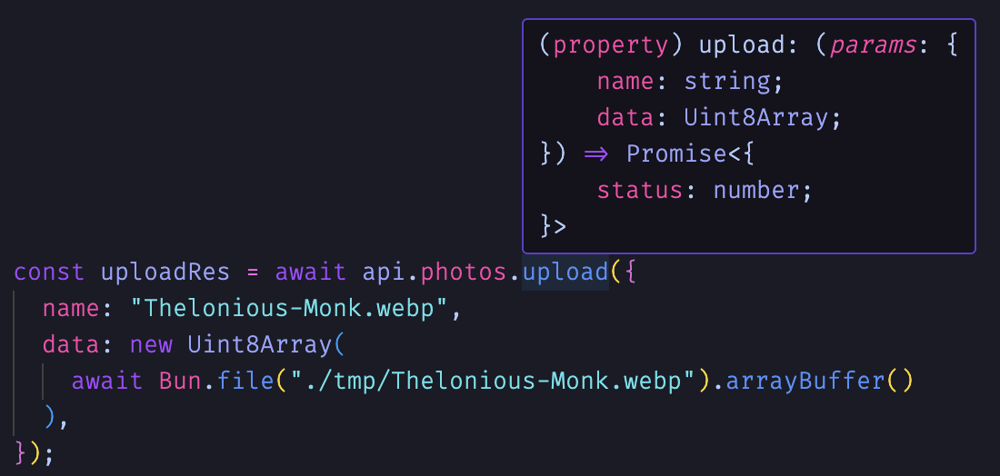

# ∫ integro

API integration with E2E integrity. Node API service with automatic client-side type safety.

## Warning
Integro is under active development and breaking changes may occur at any time. For this reason, we recommend pinning the exact version of integro in your package.json file.

## Installation

Install integro in your server app and client app (optional on the client side, see [Re-exporting createClient](#re-exporting-createclient)).

```bash
npm install integro
```

## Getting started

### Server side

First, create your server-side app using plain object style. No need to worry about routes.

```ts
// app.ts

export app = {
  greetings: {
    sayHi: (name: string) => `Hi, ${name}!`,
    sayBye: (name: string) => `Bye, ${name}!`
  }
};

export type App = typeof App;
```

Start up the server with one line:

```ts
// server.ts

import { createServer } from 'integro';
import { app } from './app';

const server = createServer(app);

server.listen(8000, undefined, () =>
  console.info(`Integro listening on port 8000 ...`)
);
```

### Client side

Create the client-side api proxy object. When using in a browser, `createClient` must be imported from 'integro/browser'. If your client is in node or bun, then `createClient` may be imported from either 'integro' or 'integro/browser'.

```ts
// api.ts

import { createClient } from 'integro/browser';
import type { App } from '@repo/api';

export const api = createClient<App>('http://localhost:8000');
```

Use your fully type-safe api object.

```ts
// sayHi.ts

import { api } from './api.ts';

const res = await api.greetings.sayHi('Gerald'); // 'Hi, Gerald!'
```

## Re-exporting createClient

Wouldn't be easier if your client app didn't need to depend on integro? Of course! Let's make it happen. Simply re-export a typed version of integro's createClient function:

```ts
// Server repo

import { createClient } from 'integro/browser';
import type { app } from './app';

export const createApiClient = createClient<typeof app>;
```
```ts
// Client repo

import type { createApiClient } from '@repo/api';

export const api = createApiClient('http://localhost:8000');
```

## Type safety

Integro provides end-to-end type safety out of the box. That's the whole point!

An integro app object must contain only functions and nested app objects, which must contain only functions and nested app objects, and so on.

Example:
```ts
// app.ts

export const app = {
  version: () => '1.0.0',
  artists: {
    list: () => orm.artist.getAll(),
    create: (artist: Artist) => orm.artist.create(artist),
    get: (id: string) => orm.artist.get(id),
    delete: (id: string) => orm.artist.delete(id),
    update: (id: string, artist: Artist) => orm.artist.update(id, artist),
    photos: {
      list: (artistId: string) => orm.artist.get(artistId).photo.getAll(),
      get: (id: string) => orm.photo.get(id),
    },
  },
};
```

On the client side, methods are fully typed and converted to async functions.


### Server app type

Typing your app object is optional, but it can help find and fix issues early. There are two options for this:

```ts
import { IntegroApp } from 'integro';

export const app = {
  /* ... */
} satisfies IntegroApp;
```

... or ...

```ts
import { defineApp } from 'integro';

export const app = defineApp({
  /* ... */
});
```

## Lazy loading

If your server app is large, it may be expensive to initialize it all at once. In this case, you can use integro's `unwrap()` helper function along with dynamic imports.

```ts
// artists.ts
export const artists = {
  list: () => orm.artist.getAll(),
  create: (artist: Artist) => orm.artist.create(artist),
  get: (id: string) => orm.artist.get(id),
  delete: (id: string) => orm.artist.delete(id),
  update: (id: string, artist: Artist) => orm.artist.update(id, artist),
}
```

```ts
// photos.ts
export const photos = {
  list: (artistId: string) => orm.artist.get(artistId).photo.getAll(),
  get: (id: string) => orm.photo.get(id),
}
```

```ts
// app.ts
import { unwrap } from 'integro';
import { artists } from 'artists';

export const app = {
  version: () => '1.0.0',
  artists, // regular, non-lazy import
  photos: unwrap(() => import('./photos').then(module => module.photos)), // lazy import
}
```

The client object is typed as if using regular object nesting:



## Middleware

Integro supports middleware functions for providing basic authentication or other requirements. A middleware function takes a [Request](https://developer.mozilla.org/en-US/docs/Web/API/Request) as its only parameter and returns a Request.

```ts
// Server

import { createServer } from 'integro';
import { app } from './app';

const checkAuthentication = (req: Request) => {
  const token = req.headers.get('Authorization');

  if (!isValid(token)) throw new Error('User not authenticated');

  return req;
}

const server = createServer(app, { middleware: [checkAuthentication] });

server.listen(8000, undefined, () =>
  console.info(`Integro listening on port 8000 ...`)
);
```

```ts
// Client

const authenticate = (req: Request) => {
  const newReq = req.clone();

  newReq.headers.set('Authorization', `bearer ${token}`);

  return newReq;
}

createClient('http://localhost:8000', {
  middleware: [authenticate]
});
```

## Fine-grained authentication/authorization guard

In addition to usage for lazy loading, the `unwrap` function can also be used to inspect the request object.

```ts
import { unwrap } from 'integro';

export const app = {
  admin: unwrap(request => {
    const token = request.headers.get('Authorization');

    if (!isAdmin(token)) {
      throw new Error('User is not authenticated');
    }

    return {
      getUser: (id: string) => orm.users.getById(id),
      listUsers: () => orm.users.getAll(),
    };
  }),
};
```

## Response headers

The `respondWith` helper allows you to customize the response headers.

Here is an example of rudimentary login/logout endpoints:

```ts
import cookie from 'cookie';
import { respondWith } from 'integro';

export const app = {
  auth: {
    login: (username: string, password: string) => {
      if (username && password) {
        const headers = new Headers();

        if (!isValid(username, password)) throw new Error('No match!');

        headers.set('Set-Cookie', cookie.serialize('session', username));

        return respondWith(undefined, { headers });
      } else {
        throw new Error('Not authenticated');
      }
    },
    logout: () => {
      const headers = new Headers();

      headers.set('Set-Cookie', cookie.serialize('session', '', { expires: new Date(0) }));

      return respondWith(undefined, { headers });
    },
  },
};
```

## Cross-Origin Resource Sharing (CORS)

Both `createClient` and `createServer` accept optional properties.

```ts
// Server

const server = createServer(app, {
  headers: {
    'Access-Control-Allow-Credentials': 'true',
    'access-control-allow-origin': 'http://localhost:5173',
    'access-control-max-age': '2592000'
  }
});
```

```ts
// Client

import { createClient } from 'integro/browser';
import type { App } from "@repo/my-server";

export const api = createClient<App>("http://localhost:8000", {
  fetchOptions: { credentials: 'include' }
});
```

## Server side validation

Type safety can help you avoid most problems at development and build time, but what about protecting the server against unforeseeable bugs or bad actors?

Server side validation is currently not included out of the box, but there are many great options already available to add validation with little effort.

### With Prisma

[Prisma](https://www.prisma.io/docs) includes validation, so you can simply export many prisma methods directly:

```ts
import { prisma } from './prisma';

export const app = {
  artist: {
    findFirst: prisma.artist.findFirst,
    findMany: prisma.artist.findMany,
  },
};
```

### With Typia

[Typia](https://typia.io/docs/) includes an `assertParameters()` guard which validates the input parameters to a given function based only on TS types:

```ts
import typia from 'typia';

export const app = {
  repeatString: assertParameters(
    (text: string, times: number) => Array(times).fill(text).join(', ')
  )
};
```

### With Zod

```ts
import z from 'zod';

export const app = {
  repeatString: z.function().args(z.string(), z.number()).implement(
    // text and times types are infered via zod
    (text, times) => Array(times).fill(text).join(', ')
  ),
};
```

## License

[MIT](./LICENSE.md)
